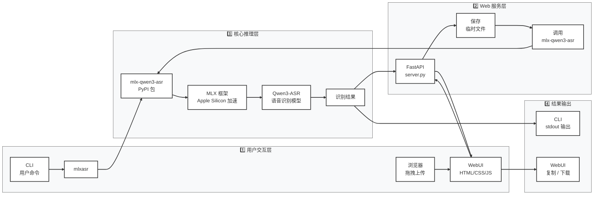

# MLX-Qwen3-ASR-tool

基于 MLX 框架的 Qwen3-ASR 语音识别工具，专为 Apple Silicon 芯片（M4）优化，提供高效、准确的本地语音转文字功能。

## 🚀 项目特点

- **本地处理**：所有语音识别都在本地进行，保护隐私，无需网络连接
- **高性能**：针对 Apple Silicon 芯片优化，M4 芯片可获得最佳性能
- **多模型支持**：提供不同大小的模型选择（0.6B/1.7B），平衡速度与准确率
- **多格式支持**：支持多种音频和视频格式的直接识别
- **丰富功能**：支持时间戳、批量处理、静音检测等高级功能
- **易于使用**：提供简洁的命令行接口，一键安装即可使用
- **可选 WebUI**：提供浏览器图形界面，拖拽上传更方便

## 📋 系统要求

- **操作系统**：macOS 14.0+ (Sonoma 或更高版本)
- **芯片**：Apple Silicon M系列芯片（M1/M2/M3/M4）
- **内存**：建议 8GB 以上（16GB 最佳）
- **存储空间**：至少 10GB 可用空间

## 🛠️ 安装方法

### 方法一：一键安装（推荐）

```bash
# 进入安装目录
cd MLX-Qwen-ASR-tool

# 赋予脚本执行权限
chmod +x install.sh

# 运行安装脚本
./install.sh
```

### 方法二：手动安装

详细的手动安装步骤请查看 [quickStart.md](quickStart.md) 文件。

## 📖 使用方法

### 基础使用

```bash
# 基础语音转文字
mlxasr 你的音频.mp3

# 转写并保存为文本（推荐使用重定向）
mlxasr 录音.mp3 > 笔记.txt

# 带时间戳（适合网课/直播回看）
mlxasr 录音.mp3 --timestamps > 笔记带时间戳.txt

# 使用更精准的 1.7B 模型
mlxasr 录音.mp3 --model Qwen/Qwen3-ASR-1.7B
```

### 高级功能

- **批量处理**：`mlxasr *.mp3 --output-dir 转写结果`
- **调整语言**：`mlxasr 录音.mp3 --language zh`
- **设置置信度**：`mlxasr 录音.mp3 --min-confidence 0.8`
- **静音检测**：`mlxasr 录音.mp3 --detect-silence`
- **说话人分割**：`mlxasr 录音.mp3 --diarize`

详细的命令参数说明请查看 [quickStart.md](quickStart.md) 文件。

## 🌐 Web 界面

提供了简洁的 Web 界面，可以在浏览器中上传音频并获取识别结果：

### 功能特点
- 🎙️ **拖拽上传**：支持拖拽或点击选择音频文件
- 🎯 **模型选择**：可选 0.6B（更快）或 1.7B（更精准）
- ⏱️ **时间戳选项**：可选择输出包含时间戳
- 📊 **进度显示**：上传和识别进度实时显示
- 📋 **一键复制**：识别结果一键复制到剪贴板
- ⬇️ **下载结果**：支持下载文本文件
- 🔒 **隐私保护**：所有处理都在本地完成，不上传到云端
- 🎨 **现代界面**：简洁美观，响应式设计支持移动端

### 启动 WebUI

```bash
# 进入项目目录
cd MLX-Qwen-ASR-tool

# 赋予执行权限
chmod +x run-webui.sh

# 启动 WebUI
./run-webui.sh
```

首次启动会自动安装依赖，然后在 `http://localhost:8000` 启动服务，在浏览器打开即可使用。

详细说明请查看 [webui/README.md](webui/README.md)。

## 🎯 支持格式

### 音频格式
- mp3 / wav / m4a / flac / aac / ogg / wma

### 视频格式（自动提取音频）
- mp4 / mov / avi / mkv / webm

## ⚡ 性能优化（M4芯片）

M4 芯片用户可以获得最佳性能体验：

- **内存优化**：`mlxasr 长音频.mp3 --chunk-size 10`
- **速度优化**：`mlxasr 录音.mp3 --num-threads 8`
- **质量优化**：`mlxasr 重要会议.mp3 --model Qwen/Qwen3-ASR-1.7B --beam-size 5`

## ⬇️ 模型下载

如果模型下载失败或中断，可以使用独立的下载脚本重新下载：

```bash
# 进入安装目录
cd MLX-Qwen-ASR-tool

# 运行下载脚本
./download_models.sh
```

**功能特性：**
- ✅ 自动使用 Hugging Face 国内镜像加速
- ✅ 自动清理不完整的下载文件
- ✅ 显示当前已下载模型的状态和大小
- ✅ 交互式选择下载选项

**下载选项：**
```
请选择下载选项：
  1. 只下载默认模型（Qwen/Qwen3-ASR-0.6B，约 1.2GB）
  2. 下载默认模型 + 1.7B 模型（约 1.2GB + 3.4GB = 4.6GB）
  3. 只下载 1.7B 模型（约 3.4GB）
  4. 只显示当前状态，不下载
```

## 🏗️ 项目架构

### 整体架构

```
┌─────────────────────────────────────────────────────────────┐
│                     用户交互层                                │
│  ┌───────────────┐  ┌─────────────────────────────────────┐  │
│  │  CLI 命令行    │  │        WebUI 浏览器界面               │  │
│  │  mlxasr 命令   │  │  拖拽上传 + 模型选择 + 结果展示        │  │
│  └───────────────┘  └─────────────────────────────────────┘  │
└─────────────────────────────────────────────────────────────┘
                              ↓
┌─────────────────────────────────────────────────────────────┐
│                   Web 服务层 (可选)                           │
│              FastAPI + Uvicorn                              │
│  - /api/status: 查询模型下载状态                               │
│  - /api/transcribe: 接收音频，调用 CLI 核心引擎                 │
│  - 静态文件托管: 前端页面                                       │
└─────────────────────────────────────────────────────────────┘
                              ↓
┌─────────────────────────────────────────────────────────────┐
│                   核心推理引擎                               │
│          PyPI 包: mlx-qwen3-asr (mlx-community)             │
│  - 音频解码 (ffmpeg)                                         │
│  - 分块处理 (chunking)                                      │
│  - 语音特征提取                                              │
│  - Qwen3-ASR 模型推理 (MLX 加速)                             │
│  - 后处理 & 时间戳生成                                        │
└─────────────────────────────────────────────────────────────┘
                              ↓
┌─────────────────────────────────────────────────────────────┐
│                     底层框架                                 │
│  ┌───────────────┐  ┌────────────────┐  ┌───────────────┐  │
│  │  MLX          │  │  Hugging Face  │  │   ffmpeg      │  │
│  │ Apple Silicon │  │   Hub 模型缓存  │  │  音频/视频解码  │  │
│  │   神经网络加速  │  │                │  │               │  │
│  └───────────────┘  └────────────────┘  └───────────────┘  │
└─────────────────────────────────────────────────────────────┘
                              ↓
┌─────────────────────────────────────────────────────────────┐
│                     模型文件                                │
│  - Qwen/Qwen3-ASR-0.6B  (约 1.2GB)  更快                    │
│  - Qwen/Qwen3-ASR-1.7B  (约 3.4GB)  更精准                  │
│  存储位置: ~/.cache/huggingface/hub/                        │
└─────────────────────────────────────────────────────────────┘
```

### 关键组件

| 组件                  | 位置           | 职责                                                                 |
|:-------------------- |:------------- |:------------------------------------------------------------------- |
| **install.sh**        | 项目根目录      | 一键安装脚本：检测芯片、安装依赖、创建虚拟环境、配置 CLI 命令、预下载模型     |
| **download_models.sh**| 项目根目录      | 交互式模型下载工具，支持国内镜像，清理不完整下载                            |
| **uninstall.sh**      | 项目根目录      | 清理卸载脚本                                                          |
| **run-webui.sh**      | 项目根目录      | WebUI 启动脚本，自动安装依赖                                           |
| **webui/server.py**   | webui/         | FastAPI 后端，提供 API 接口                                            |
| **webui/static/**    | webui/static/  | 前端静态文件，拖拽上传、进度显示、复制/下载                                |
| **mlx-qwen3-asr**    | PyPI 包        | 核心推理引擎，由 mlx-community 维护                                     |

### 技术栈

| 技术          | 说明                                       |
|:------------ |:----------------------------------------- |
| 推理框架      | MLX (Apple Silicon 原生优化)                |
| 模型          | 通义千问 Qwen3-ASR (0.6B / 1.7B)           |
| Web 后端      | FastAPI + Uvicorn                          |
| Web 前端      | 原生 HTML/CSS/JavaScript (无框架依赖)       |
| 音频处理      | ffmpeg                                     |
| 部署方式      | Python 虚拟环境，纯本地离线运行              |

### 系统架构流程图



### 设计特点

| 特点             | 说明                                            |
|:--------------- |:---------------------------------------------- |
| **完全本地**     | 所有处理在本地完成，保护隐私                      |
| **Apple Silicon 优先** | 针对 M 系列芯片做了特定优化                     |
| **双接口**       | 同时提供 CLI 和 WebUI，满足不同场景               |
| **模型选择**     | 支持 0.6B/1.7B 两种模型，平衡速度与准确率         |
| **格式支持**     | 支持多种音频格式以及直接视频文件（自动提取音频）   |
| **国内友好**     | 默认使用清华 PyPI 镜像 + Hugging Face 镜像加速    |

## 📁 项目文件结构

```
MLX-Qwen3-ASR-tool/
├── install.sh           # 一键安装脚本
├── uninstall.sh         # 卸载脚本
├── download_models.sh   # 模型下载脚本
├── run-webui.sh         # WebUI 启动脚本
├── quickStart.md        # 详细使用指南
├── troubleshooting.md  # 故障排除指南
├── README.md            # 项目概述
└── webui/
    ├── server.py        # FastAPI 后端
    ├── README.md        # WebUI 说明
    └── static/          # 前端静态文件
        ├── index.html
        ├── style.css
        └── app.js
```

## 🗑️ 卸载方法

如果需要卸载 MLX-Qwen3-ASR，请执行以下命令：

```bash
# 进入安装目录
cd MLX-Qwen-ASR-tool

# 赋予脚本执行权限
chmod +x uninstall.sh

# 运行卸载脚本
./uninstall.sh
```

卸载脚本会：
1. 删除工作目录 `~/mlx-qwen3-asr`
2. 清理 `.zshrc` 中的快捷命令配置
3. 可选删除下载的模型文件

## 🔧 故障排除

常见问题和解决方案请查看 [troubleshooting.md](troubleshooting.md) 文件。

## 🤝 贡献

欢迎贡献代码、报告问题或提出建议！

1. Fork 本项目
2. 创建功能分支
3. 提交更改
4. 发起 Pull Request

## 📄 许可证

本项目基于 Apache 2.0。详见 [LICENSE](LICENSE) 文件。

## 📞 支持

- **项目地址**：https://github.com/aaronTang98/MLX-Qwen-ASR-tool
- **问题反馈**：在 GitHub 上提交 Issue
- **讨论社区**：加入相关技术社区交流

---

**提示**：M4 芯片用户可以获得最佳性能体验，建议保持系统和软件的最新版本以获得更好的识别效果。
